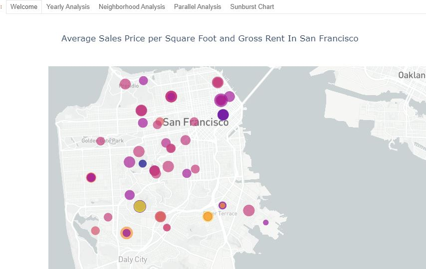

# San Francisco Housing Cost Analysis

This project has two parts.  Part one using housing data from San Francisco housing market to provide an analysis on housing costs in different neighborhoods, as well as the difference in costs between renting and buying.  In addition, it also creates plots from the different cost analyses.  It provides interactive plots as well as standard plots.  The second part pulls all these plots together in the form of a dashboard.  

## Technologies 

This project used Python 3.8 and iPython in Jupyter Lab.  Windows 10 is the operating system. 

## Libraries Used
    
    1. os - used to access operating system
    2. pandas - used to read and write data into dataframes
    3. panel - used to create dashboard
    4. plotly - used to create paralell coordinates and categories graphs
    5. hvplot - used to create interactive graphs
    6. matplotlib - graphing tool
    7. numpy - used for calculations
    8. dotenv - used for pulling API
    9. Pathlib - used to create Path for .csv files
    
## Installation Guide 
This project requires the latest version of Anaconda and a PyViz Environment

## Example

## Usage

To use this project, simply import the csv you want to use and make sure that the dataframes are set to the same column and run the rental analysis.  After rental analysis has been run, run the dashboard. 

## Contributors
Ryan Dibeler

ryandibeler@gmail.com

## License
MIT License

Copyright (c) [2021] [Ryan Dibeler]

Permission is hereby granted, free of charge, to any person obtaining a copy
of this software and associated documentation files (the "Software"), to deal
in the Software without restriction, including without limitation the rights
to use, copy, modify, merge, publish, distribute, sublicense, and/or sell
copies of the Software, and to permit persons to whom the Software is
furnished to do so, subject to the following conditions:

The above copyright notice and this permission notice shall be included in all
copies or substantial portions of the Software.

THE SOFTWARE IS PROVIDED "AS IS", WITHOUT WARRANTY OF ANY KIND, EXPRESS OR
IMPLIED, INCLUDING BUT NOT LIMITED TO THE WARRANTIES OF MERCHANTABILITY,
FITNESS FOR A PARTICULAR PURPOSE AND NONINFRINGEMENT. IN NO EVENT SHALL THE
AUTHORS OR COPYRIGHT HOLDERS BE LIABLE FOR ANY CLAIM, DAMAGES OR OTHER
LIABILITY, WHETHER IN AN ACTION OF CONTRACT, TORT OR OTHERWISE, ARISING FROM,
OUT OF OR IN CONNECTION WITH THE SOFTWARE OR THE USE OR OTHER DEALINGS IN THE
SOFTWARE.

